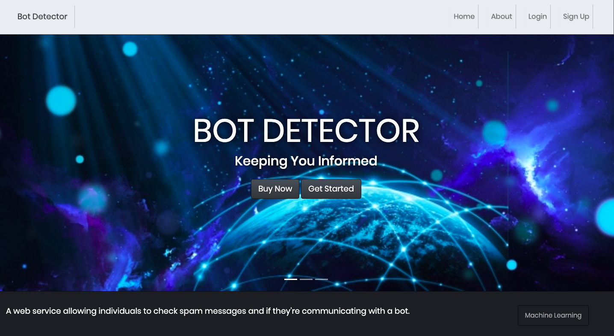

# Gif Search



## Authors

* **Andre Williams 

## Getting Started

These instructions will get you a copy of the project up and running on your local machine for development and testing purposes.

### Prerequisites
If you haven't already installed pip3 for Python3
```
sudo apt install python3-pip
```
Install flask and requests
```
pip3 install flask
pip3 install requests
pip3 install sqlalchemy
pip3 install stripe
pip3 install flask_login

```

### Installing

1. Clone the respository
```
git clone git@github.com:Andre-Williams22/bot_detector.git
```
2. Make sure in the correct directory

3. Enter the development environment
```
export FLASK_ENV=development 
```
4. Open your terminal and run flask
```
flask run
```
You should see something similar to the output below:
```
* Environment: production
   WARNING: This is a development server. Do not use it in a production deployment.
   Use a production WSGI server instead.
* Debug mode: off
* Running on (Your Localhost IP) (Press CTRL+C to quit)
```

## Built With

* [Flask](https://palletsprojects.com/p/flask/) - Lightweight web application framework
* [Jinja](https://palletsprojects.com/p/jinja/) - Template engine for python
* [Stripe API](https://tenor.com/gifapi) - API for payments 
* [Bootstrap] (https://getbootstrap.com/) - For styling
* [SQLAlchemy] (https://docs.sqlalchemy.org/en/13/dialects/sqlite.html) - Database for user registration

## Acknowledgments


